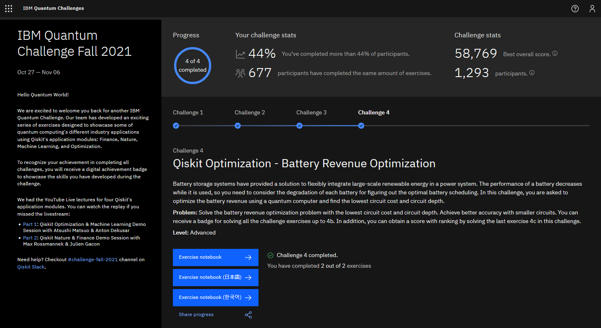
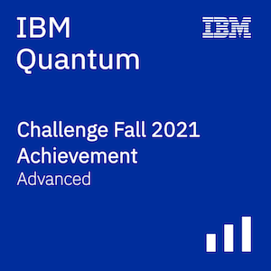

# IBM Quantum Challenge Fall 2021  
  
These are the solutions I submitted for the [IBM Quantum Challenge Fall 2021](https://challenges.quantum-computing.ibm.com/fall-2021)  
The original challenge repository is at [/qiskit-community/ibm-quantum-challenge-fall-2021](https://github.com/qiskit-community/ibm-quantum-challenge-fall-2021)  
  
## Challenge Details  
__Site:__ [challenges.quantum-computing.ibm.com/fall-2021](https://challenges.quantum-computing.ibm.com/fall-2021)  
__Date:__ November 2021  
  
## Certificate  
Here's a screenshot of my challenge portal dashboard.  
  
  
And here's my advanced badge, for completing all the exercises.  
  
  
## Description  
The challenge consisted of 4 challenges, in each `challenge-x` folder.  
Each folder has a `index.md` introduction, a `.ipynb` workbook, and a `.html` copy of the workbook.  
Unfortunately, I didn't have time to finish the extra exercise 4c, but sections of my implementation do give correct outputs. Maybe I'll revisit it in the future.  
  
## Topics  
[`challenge1`](challenge-1/challenge-1.ipynb) - Qiskit Finance: Portfolio Optimisation  
[`challenge2`](challenge-2/challenge-2.ipynb) - Qiskit Nature: Bandgap Calculation  
[`challenge3`](challenge-3/challenge-3.ipynb) - Qiskit Machine Learning: Image Classification  
[`challenge4`](challenge-4/challenge-4.ipynb) - Qiskit Optimisation: Resource Allocation  